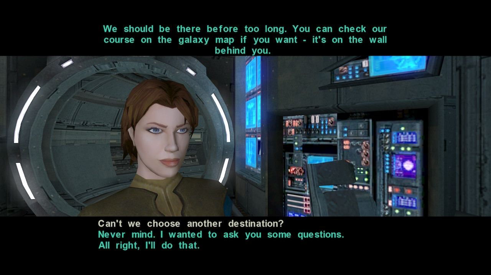

# kotor2-mod-restore-atton-dialog-lines

## Description

Enables additional reply option after Atton speaks (strref=75200):

> We should be there before too long. You can check our course on the galaxy map
if you want - it's on the wall behind you.

This mod also modifies the default dialog line of the reply which don't
make much sense in this context:

> What do you mean, "not much use?"

by

> Can't we choose another destination?




## How to install

### Recomended

Use Holopatcher to edit the .dlg file.

### Classic

Place the .dlg file in override.


## How does it work?

### 003atton.dlg

To enable this dialog, the game checks the following:
```C
GetGlobalNumber("003EBO_Atton_Talk") < 5
```

The variables `"003EBO_Atton_Talk"` and `5` are actually arguments provided by
`003atton.dlg` to the script `c_global_lt.ncs`.

However, when the dialog line `135181 - "{Sitting}"` is reached, i.e.
when starting the conversation after you spoke to Kreia,
`"003EBO_Atton_Talk"` is set to 5. Then Atton starts speaking:

> How's our passenger? She still aging?

This is preventing the dialog line from appearing after Atton says:

> We should be there before too long. You can check our course on the galaxy
map if you want - it's on the wall behind you.

This mod changes the value `5` to `6` so this dialog line appear.
The other dialog option also have `6`.


## Credits

- Xoreos-tools (https://github.com/xoreos/xoreos-tools)
- TSL Patcher (https://deadlystream.com/files/file/1039-tsl-patcher-tlked-and-accessories/)

## License
This mod is licensed under [Creative Commons Attribution 4.0 International](http://creativecommons.org/licenses/by/4.0/).
Please give appropriate credit when using or modifying this work.
